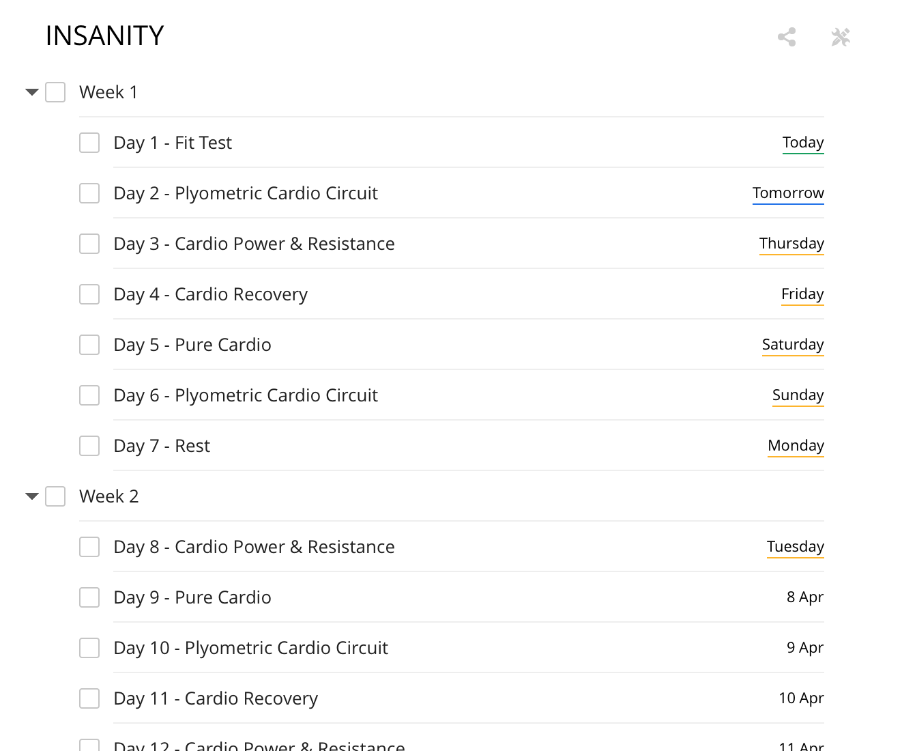

# Todoist Insanity Workout Template

One of the great premium features of Todoist is the ability to import project templates.

This template will create a full 63-day schedule for your Beachbody INSANITY workout, starting "Today" and organised as per the official workout, split into each week of the program.

**How to Use (Web / Desktop)**

* Download the insanity.todoist.template.txt file included in this templates folder of this package
* Add a new Project (eg; INSANITY)
* From the "Task Actions" icon in the right hand pane, select "Import from template"
* In the file open window, Select the insanity.todoist.template.txt file downloaded
* Import file
* The following shows how this will look in Todoist:

This template is provided as a way to give back to the Beachbody and Todoist communities.

_INSANITY is, and remains Copyright :copyright: Beachbody, LLC_

_Todoist is Copyright :copyright: Doist Ltd_

